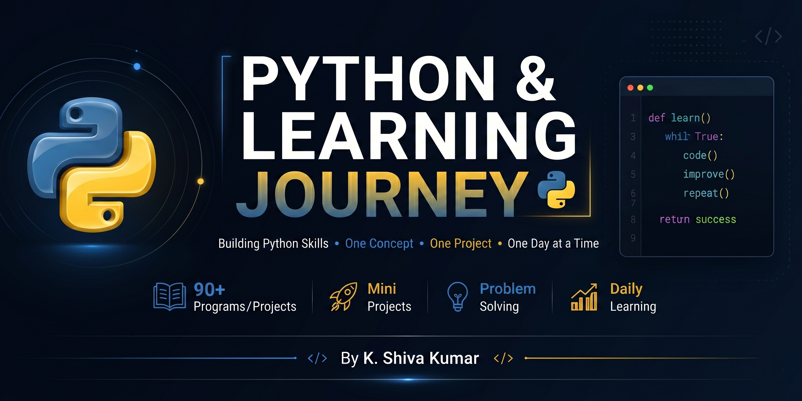

<h1 align="center">🐍 Python Learning Journey</h1>

<p align="center">
  
</p>

<p align="center">
  
</p>

<p align="center">
  <strong>"Learning by Building. Documenting my complete Python journey."</strong><br>
  <sub>Every concept in this repository is followed by practical implementations before moving to the next topic.</sub>
</p>

<p align="center">
  <a href="https://python.org"></a>
  
  
  
</p>

---

## 🎯 Why This Repository Exists

This repository documents my progress in learning Python, focusing on understanding core programming concepts and applying them through standalone, practical programs. Instead of only studying theory, I build hands-on projects to strengthen my problem-solving skills, logic, and coding confidence. 

### What You Can Learn:
- **Core Fundamentals:** Variables, conditional logic, loops, and data structures.
- **Advanced Logic:** Recursion, anonymous functions, and file I/O operations.
- **Software Design:** Object-Oriented Programming (OOP) paradigms, inheritance, encapsulation, polymorphism, and magic methods.
- **Mini-Projects:** Real-world implementations like banking systems, ATM simulations, inventory trackers, and game mechanics.

### Who It Is For:
- **Recruiters & Engineering Managers** looking to assess my growth, coding style, and commitment to learning.
- **Python Beginners** seeking well-documented examples and standalone projects to learn from.
- **Myself** as a reference and a testament to my dedication to learning by building.

---

## 💡 Repository Philosophy

> [!TIP]
> **"I believe programming is learned by building."**
> Every concept in this repository is followed by practical implementations before moving to the next topic. There are no placeholder libraries or empty files here—only active coding.

---

## ⚡ Repository at a Glance

| Metric / Dimension | Current Status / Highlights |
| :--- | :--- |
| 📅 **Learning Days Completed** | **12 Days** of focused practice |
| 🛠️ **Programs & Scripts Built** | **90+ Standalone Python programs** |
| 🏗️ **Core Paradigm** | Procedural, Functional, and Object-Oriented Programming (OOP) |
| 🚀 **External Dependencies** | **None** (Only standard library for seamless, zero-config runs) |
| 📈 **Repository Status** | **Active** (Updates batch-pushed upon topic completion) |
| 🔄 **Last Updated Topic** | **OOP Part 2 & Magic (Dunder) Methods** |

---

## 🌟 Featured Projects

Here are some of the most robust, object-oriented, and logically complex projects in this repository:

| Project | File Name | Key Concepts | Description |
| :--- | :--- | :--- | :--- |
| 🏦 **ATM System (Advanced)** | [`ATM_System.py`](ATM_System.py) | Encapsulation, State Updates, Verification | Simulates ATM operations like PIN verification, deposits, withdrawals, and PIN changes. |
| 📚 **Library Management** | [`Library_Management_System.py`](Library_Management_System.py) | Multi-class Interaction, Object Lists | Manages books in a library, including adding, issuing, and returning books. |
| 🏪 **Inventory Management** | [`inventory_management_system.py`](inventory_management_system.py) | Dictionaries, State Tracking, Validation | A class-based system to add/remove stock and check availability across multiple items. |
| 🔐 **Password Generator** | [`Mini_pjt_2.py`](Mini_pjt_2.py) | `random` & `string` modules, User Input | Generates secure passwords of user-defined length using letters, digits, and special characters. |
| 🎯 **Guess Number Game** | [`Mini_Pjt_1.py`](Mini_Pjt_1.py) | Game Loop, Conditionals, Input Casting | An interactive console game where the user guesses a random number with guided hints. |
| 👨‍🎓 **Student Report Card** | [`Student_Report_Card.py`](Student_Report_Card.py) | Constructors, Conditionals, Average Logic | A class-based system to store student marks and calculate averages and overall results. |
| 🧮 **Complex Number Calculator** | [`complex_number_calculator.py`](complex_number_calculator.py) | Operator Overloading (`__add__`, `__sub__`, `__str__`) | A custom `ComplexNumber` class supporting arithmetic operations via operator overloading. |
| 🚗 **Vehicle Rental System** | [`vehicle_rental_system.py`](vehicle_rental_system.py) | State Management, Object Interaction | Simulates renting and returning vehicles from a fleet, tracking available vs. rented cars. |
| 💳 **Bank Account System** | [`bank_account_private.py`](bank_account_private.py) | Encapsulation, Private Members | A bank account system demonstrating encapsulation using private attributes and methods. |

---

## 🗺️ Learning Timeline & Progress

Below is the roadmap of my Python learning journey, showing completed concepts and topics planned for the future:

| Topic / Section | Status | Concepts Mastered / Target |
| :--- | :---: | :--- |
| 📦 **Python Basics** | ✅ Completed | Variables, Data Types, Operators, Input/Output, Type Casting |
| 🧵 **Strings & Conditions** | ✅ Completed | Slicing, String Formatting, Conditional Logic (`if-elif-else`) |
| 📋 **Lists & Tuples** | ✅ Completed | Mutable/Immutable collections, Indexing, Nested Lists/Tuples |
| 📖 **Dictionaries & Sets** | ✅ Completed | Key-Value lookups, Sets, Set Operations, Membership Tests |
| 🔄 **Loops & Iteration** | ✅ Completed | For/While Loops, Range, Loop Control (`break`/`continue`/`pass`) |
| 🔧 **Functions & Recursion** | ✅ Completed | Code reusability, parameters, recursive call stack, base cases |
| 📁 **File Handling (I/O)** | ✅ Completed | File modes (`r`, `w`, `a`), `with` statements, Pointer Manipulation (`seek`/`tell`) |
| 🏗️ **OOP Part 1** | ✅ Completed | Classes, Objects, Constructors (`__init__`), Instance variables/methods |
| 🏛️ **OOP Part 2** | ✅ Completed | Inheritance, `super()`, Encapsulation, Polymorphism, Magic (Dunder) Methods |
| ⚠️ **Exception Handling** | ⬜ *Next Up* | Error Handling (`try-except-finally`), Custom Exceptions |
| 📦 **Modules & Packages** | ⬜ Planned | Project organization, Custom module imports |
| 🌐 **APIs & HTTP** | ⬜ Planned | Interacting with web services, JSON parsing |
| 🗄️ **Databases (SQLite)** | ⬜ Planned | Database integration, writing SQL queries in Python |
| 🧪 **Unit Testing** | ⬜ Planned | Verifying code correctness with `unittest`/`pytest` |
| 🧠 **DSA (Data Structures & Algos)** | ⬜ Planned | Lists, Stacks, Queues, Trees, Search/Sort Algorithms |

### 📈 Skill Coverage

```text
Python Basics           ████████████████████ 100%
Strings & Conditions    ████████████████████ 100%
Lists & Tuples          ████████████████████ 100%
Dictionaries & Sets     ████████████████████ 100%
Loops & Iteration       ████████████████████ 100%
Functions & Recursion   ████████████████████ 100%
File Handling (I/O)     ████████████████████ 100%
OOP (Part 1 & 2)        ████████████████████ 100%
Exception Handling      ░░░░░░░░░░░░░░░░░░░░ 0%
```

---


## 🛠️ Developed Skills

<p align="center">
  
  
  
  <br><br>
  
  
  
  <br><br>
  
  
</p>


## 📅 Detailed Learning Log

<details>
<summary><b>📅 Day 1 – Python Basics</b></summary>

### 📚 Day 1: Topics Covered
- **Variables & Identifiers:** Storing and naming data in memory.
- **Data Types:** Working with `int`, `float`, `string`, `boolean`.
- **Input / Output:** Taking user input and displaying formatted results.
- **Operators:** Performing basic arithmetic operations.
- **Type Conversion:** Converting data between types (casting).

### 🛠️ Day 1: Programs Built
| File Name | Key Concepts | Description |
| :--- | :--- | :--- |
| [`Personal_Info_Printer.py`](Personal_Info_Printer.py) | Variables, Input/Output, Data Types | Takes user input (name, age, city) and displays a formatted introduction. |
| [`Simple_Calculator.py`](Simple_Calculator.py) | Operators, Input/Output, Type Conversion | Performs addition, subtraction, multiplication, division, power, and modulus. |
| [`Temperature_Converter.py`](Temperature_Converter.py) | Operators, Input/Output, Data Types | Converts Celsius to Fahrenheit using standard mathematical formulas. |
| [`Student_Marks_Analyzer.py`](Student_Marks_Analyzer.py) | Variables, Operators, Type Conversion | Takes marks of multiple subjects and calculates total and average. |
| [`Username_Generator.py`](Username_Generator.py) | Variables, Strings, Input/Output | Generates a simple username by combining first name and last name. |
| [`Bill_Splitter_App`](Bill_Splitter_App) | Operators, Input/Output, Type Conversion | Calculates how much each person should pay when splitting a bill. |
| [`Basic_Salary_Breakdown.py`](Basic_Salary_Breakdown.py) | Variables, Operators, Data Types | Calculates HRA, DA, and total salary based on a base salary. |
| [`Area_Calculator.py`](Area_Calculator.py) | Operators, Input/Output, Data Types | Calculates the area of shapes (circle, rectangle, triangle, square). |
| [`Time_Converter.py`](Time_Converter.py) | Operators, Input/Output, Type Conversion | Converts time values between hours, minutes, and seconds. |
| [`MiniProfile_Card_Generator.py`](MiniProfile_Card_Generator.py) | Variables, Strings, Input/Output | Displays a structured profile card using user details like name, age, city, and skills. |

### 🔑 Day 1: Key Takeaways
- Built a strong foundation in Python basics.
- Learned how to take user input and process data dynamically.
- Applied concepts through hands-on mini-projects.
- Improved problem-solving by breaking tasks into logical steps.

</details>

<details>
<summary><b>📅 Day 2 – Strings & Conditional Statements</b></summary>

### 📚 Day 2: Topics Covered
- **Strings:** Creating, indexing, and manipulating text data.
- **String Slicing:** Extracting parts of a string using indices.
- **Conditional Statements:** Using `if`, `elif`, and `else` for decision making.
- **Nested Conditions:** Nesting conditions inside other conditions for complex logic.

### 🛠️ Day 2: Programs Built
| File Name | Key Concepts | Description |
| :--- | :--- | :--- |
| [`Even_or_Odd Checker.py`](Even_or_Odd%20Checker.py) | Conditional Statements, Operators | Takes a number as input and determines whether it is even or odd. |
| [`PositiveorNegativeorZeroChecker.py`](PositiveorNegativeorZeroChecker.py) | Conditional Statements, Comparison Operators | Classifies a number as positive, negative, or zero. |
| [`Simple_Password_Checker.py`](Simple_Password_Checker.py) | Strings, Conditional Statements | Checks whether the entered password matches a predefined password. |
| [`vowelorConsonant_checker.py`](vowelorConsonant_checker.py) | Strings, Conditional Statements | Determines whether a given character is a vowel or a consonant. |
| [`UsernameValidator.py`](UsernameValidator.py) | Strings, Conditional Statements | Validates a username based on conditions like length and format. |
| [`EmailValidator.py`](EmailValidator.py) | Strings, Conditional Statements | Performs basic validation of an email format using string checks. |
| [`basicStringAnalyzer.py`](basicStringAnalyzer.py) | Strings, Slicing | Analyzes a string to display length, first character, last character, and reversed string. |
| [`SimpleLoginSystem.py`](SimpleLoginSystem.py) | Nested Conditions, Strings | Validates user credentials using nested conditional statements. |
| [`PasswordStrengthChecker.py`](PasswordStrengthChecker.py) | Strings, Conditional Statements, Logical Operators | Evaluates password strength based on length and character requirements. |
| [`GradeCalculator.py`](GradeCalculator.py) | Conditional Statements | Assigns grades based on marks using conditional logic. |

### 🔑 Day 2: Key Takeaways
- Learned how to implement decision-making in programs.
- Improved understanding of string manipulation and slicing.
- Practiced writing logical conditions and nested checks.

</details>

<details>
<summary><b>📅 Day 3 – Lists & Tuples</b></summary>

### 📚 Day 3: Topics Covered
- **Lists:** Storing and modifying ordered collections of data.
- **Tuples:** Immutable data structures for fixed collections.
- **Indexing & Accessing Elements:** Retrieving values from lists and tuples.
- **Basic Operations:** Using built-in functions like `max()`, `min()`, `sum()`.
- **Nested Data Structures:** Using tuples inside lists for tabular data.

### 🛠️ Day 3: Programs Built
| File Name | Key Concepts | Description |
| :--- | :--- | :--- |
| [`student_performance_report.py`](student_performance_report.py) | Lists, Tuples, Built-in Functions | Stores student names and marks using tuples inside a list; identifies topper and lowest scorer. |
| [`shopping_cart_summary.py`](shopping_cart_summary.py) | Lists, Tuples, Indexing | Calculates total cost and identifies the most and least expensive items in a cart. |
| [`number_insight_tool.py`](number_insight_tool.py) | Lists, Conditional Statements | Analyzes a list of numbers to find maximum, minimum, and check existence of a value. |
| [`contact_selector.py`](contact_selector.py) | Lists, Tuples, Indexing | Retrieves contact details from a list of tuples based on user-selected index. |
| [`student_comparison_system.py`](student_comparison_system.py) | Tuples, Conditional Statements | Compares marks of two students and determines who scored higher. |

### 🔑 Day 3: Key Takeaways
- Learned how to store and manage collections of data.
- Understood the difference between lists (mutable) and tuples (immutable).
- Practiced accessing and manipulating structured, nested data.

</details>

<details>
<summary><b>📅 Day 4 – Dictionaries & Sets</b></summary>

### 📚 Day 4: Topics Covered
- **Dictionaries:** Key-value pairs to store structured, labeled data.
- **Accessing & Modifying:** Retrieving, adding, updating, and deleting dictionary data.
- **Checking Existence:** Using the `in` keyword for keys and values.
- **Sets:** Storing unique elements without duplicates.
- **Set Operations:** Union, Intersection, Difference, and Membership tests.

### 🛠️ Day 4: Programs Built
| File Name | Key Concepts | Description |
| :--- | :--- | :--- |
| [`student_database_lookup.py`](student_database_lookup.py) | Dictionaries, Conditional Statements | Stores student names and marks in a dictionary and allows checking marks by student name. |
| [`word_frequency_checker.py`](word_frequency_checker.py) | Dictionaries, Strings | Counts occurrences of specific words in a given sentence using dictionary lookups. |
| [`unique_elements_finder.py`](unique_elements_finder.py) | Sets, Data Structures | Converts a list with duplicates into a set to display unique elements. |
| [`login_system_dict.py`](login_system_dict.py) | Dictionaries, Conditionals, Nested Checks | Simulates a simple login system with credentials stored in a dictionary. |
| [`common_interest_finder.py`](common_interest_finder.py) | Sets, Set Operations, Conditionals | Finds common elements between two sets of interests to determine shared items. |
| [`inventory_tracker.py`](inventory_tracker.py) | Dictionaries, Conditional Statements | Tracks items and quantities using a dictionary; checks if a requested item is available. |
| [`course_enrollment_checker.py`](course_enrollment_checker.py) | Dictionaries, Sets, Conditionals | Stores courses with enrolled student names in a dictionary; checks enrollment status. |
| [`email_uniqueness_validator.py`](email_uniqueness_validator.py) | Sets, Conditional Statements | Maintains a set of registered emails and checks if a new email is unique before adding it. |
| [`expense_tracker.py`](expense_tracker.py) | Dictionaries, Built-in Functions | Stores expenses in a dictionary; calculates total and identifies the highest expense category. |
| [`favorite_programming_languages.py`](favorite_programming_languages.py) | Sets, Set Operations, Conditionals | Stores users' favorite languages using sets and finds common favorites. |

### 🔑 Day 4: Key Takeaways
- Learned how to store and retrieve structured data efficiently using dictionaries.
- Understood how sets ensure uniqueness and allow easy comparison.
- Built a strong foundation for more complex data handling in Python.

</details>

<details>
<summary><b>📅 Day 5 – Loops & Iteration</b></summary>

### 📚 Day 5: Topics Covered
- **For Loop:** Iterating over sequences and using the `range()` generator.
- **While Loop:** Repeating actions until a condition is met.
- **Loop Control Statements:** Using `break`, `continue`, and `pass` to alter loop execution.
- **Nested Loops:** Using loops inside loops (e.g., for multi-dimensional data).
- **Range Function:** Generating sequences of numbers efficiently.

### 🛠️ Day 5: Programs Built
| File Name | Key Concepts | Description |
| :--- | :--- | :--- |
| [`multiplication_table.py`](multiplication_table.py) | `for`, `range`, String Formatting | Takes a number and prints its multiplication table up to a given range. |
| [`factorial_calculator.py`](factorial_calculator.py) | `while`, Arithmetic, Conditionals | Calculates the factorial of a number using a `while` loop. |
| [`prime_in_range.py`](prime_in_range.py) | `for`, `while`, `break`, Conditionals | Prints all prime numbers in a given start-to-end range. |
| [`number_guessing.py`](number_guessing.py) | `while`, `break`, Conditionals | Let's the user guess a randomly generated number with high/low hints. |
| [`fibonacci_sequence.py`](fibonacci_sequence.py) | `while`, Arithmetic Operations | Generates the Fibonacci sequence up to `n` terms. |
| [`sum_natural_numbers.py`](sum_natural_numbers.py) | `for`, `range`, Arithmetic | Sums all natural numbers up to a given number using a `for` loop. |
| [`menu_calculator.py`](menu_calculator.py) | `while`, `if-elif-else`, `break` | Shows a menu of operations (+, -, *, /) and performs calculations until the user exits. |
| [`list_filter.py`](list_filter.py) | `for`, `if`, `continue`, `append()` | Filters all even or odd numbers from a list based on user choice. |
| [`password_limiter.py`](password_limiter.py) | `while`, `break`, Conditionals | Allows 3 attempts to enter the correct password, using `break` on success. |
| [`pattern_printer.py`](pattern_printer.py) | `for`, `range`, String Multiplication | Prints patterns (like triangles or pyramids) using nested loops. |

### 🔑 Day 5: Key Takeaways
- Mastered loops for repetitive tasks.
- Learned how to control loops using `break`, `continue`, and `pass`.
- Practiced combining loops with conditional logic.
- Built projects that mimic real-world automation and computation.

</details>

<details>
<summary><b>📅 Day 6 – Functions & Recursion</b></summary>

### 📚 Day 6: Topics Covered
- **Functions:** Defining reusable blocks of code using `def`.
- **Arguments & Return Values:** Passing data into functions and returning results.
- **Recursion:** A function calling itself to solve problems.
- **Recursion Control:** Implementing base cases to prevent stack overflow.

### 🛠️ Day 6: Programs Built
| File Name | Key Concepts | Description |
| :--- | :--- | :--- |
| [`factorial_recursive.py`](factorial_recursive.py) | Functions, Recursion | Calculates the factorial of a number using recursion, with user input. |
| [`fibonacci_recursive.py`](fibonacci_recursive.py) | Functions, Recursion | Generates the first `n` Fibonacci numbers using recursion. |
| [`sum_digits.py`](sum_digits.py) | Functions, Recursion | Calculates the sum of digits of a number using recursion. |
| [`power_recursive.py`](power_recursive.py) | Functions, Recursion | Calculates `x` raised to the power `y` using recursion. |
| [`palindrome_recursive.py`](palindrome_recursive.py) | Functions, Recursion, Strings | Checks if a string is a palindrome using a recursive function. |
| [`gcd_recursive.py`](gcd_recursive.py) | Functions, Recursion, Euclid's Algorithm | Calculates the Greatest Common Divisor (GCD) of two numbers recursively. |
| [`reverse_string.py`](reverse_string.py) | Functions, Recursion, String Slicing | Reverses a string using a recursive function. |
| [`decimal_to_binary.py`](decimal_to_binary.py) | Functions, Recursion, Number Systems | Converts a decimal number to binary using recursion. |
| [`countdown.py`](countdown.py) | Functions, Recursion | Prints numbers from `n` down to 1 recursively. |
| [`nested_list_sum.py`](nested_list_sum.py) | Functions, Recursion, List Handling | Calculates the sum of numbers in a nested list using recursion. |

### 🔑 Day 6: Key Takeaways
- Learned how to break problems into base cases and recursive cases.
- Practiced translating iterative logic into recursive logic.
- Strengthened reusable function design skills.

</details>

<details>
<summary><b>📅 Day 7 – File I/O</b></summary>

### 📚 Day 7: Topics Covered
- **File Reading:** Reading files using `open()` and `.read()`, `.readline()`, or `.readlines()`.
- **File Writing:** Writing/appending to files using `"w"` or `"a"` modes.
- **File Handling Modes:** `'r'`, `'w'`, `'a'`, and `'r+'`.
- **Context Managers:** Using the `with` statement for safe resource handling.

### 🛠️ Day 7: Programs Built
| File Name | Key Concepts | Description |
| :--- | :--- | :--- |
| [`word_counter.py`](word_counter.py) | File Reading, String Manipulation | Reads a text file and counts total words and word frequency. |
| [`log_analyzer.py`](log_analyzer.py) | File Reading, String Search | Reads a log file and extracts important entries such as errors or timestamps. |
| [`student_records.py`](student_records.py) | File I/O, Functions, Conditionals | Stores student info in a file and provides options to add, view, or search students. |
| [`todo_list.py`](todo_list.py) | File I/O, Lists, Loops | Adds, removes, and views tasks stored in a text file. |
| [`csv_reader.py`](csv_reader.py) | File Reading, String Splitting, Loops | Reads a CSV file and displays data in formatted output with sums/averages. |
| [`file_backup.py`](file_backup.py) | File I/O, Error Handling | Copies content of one file into a new backup file. |
| [`unique_words.py`](unique_words.py) | File Reading, Sets, Sorting | Reads a file and extracts all unique words sorted alphabetically. |
| [`diary_app.py`](diary_app.py) | Append Mode, Input/Output | Writes daily notes to a file and reads past entries by date. |
| [`line_reverser.py`](line_reverser.py) | File I/O, Lists, Loops | Reverses the order of lines in a file and saves the result to a new file. |
| [`char_frequency.py`](char_frequency.py) | File Reading, Dictionaries, Loops | Counts the frequency of each character in a file. |
| [`file_manager.py`](file_manager.py) | File I/O, `os` Module, Conditionals | A small command-line utility for basic file operations (create, read, rename, delete). |
| [`file_pointer_demo.py`](file_pointer_demo.py) | Cursor/Pointer Mechanics, Byte Offsets | Demonstrates how the file pointer moves through a file using `.tell()` and `.seek()`. |

### 🔑 Day 7: Key Takeaways
- Learned how to read from and write to files safely.
- Understood different file modes and when to use each.
- Practiced building small utilities around persistent data.

</details>

<details>
<summary><b>📅 Day 8 – Practice & Problem Solving</b></summary>

### 📚 Day 8: Topics Covered
- **Escape Sequences:** Special characters like `\n`, `\t`, `\\`, `\"`, `\'` and formatting control.
- **String Methods Revision:** Deep dive into functions like `upper()`, `lower()`, `title()`, `strip()`, `replace()`, `split()`, `join()`.
- **Mathematical Implementations:** Translating complex mathematical rules (e.g., leap years, quadratic equations) into logic.

### 🛠️ Day 8: Programs Built
| File Name | Key Concepts | Description |
| :--- | :--- | :--- |
| [`esc_sequences.py`](esc_sequences.py) | Escape Sequences, String Formatting | Demonstrates string behaviors and formatting with escape characters. |
| [`String_methods.py`](String_methods.py) | String Manipulation Methods | Exercises and implements standard Python string manipulation methods. |
| [`leap_year_checker.py`](leap_year_checker.py) | Complex Conditionals, Modulo | Implements the leap year logic based on divisibility by 4, 100, and 400. |
| [`quadratic_equation.py`](quadratic_equation.py) | Discriminant Formula, Math | Calculates real, equal, or complex roots using the quadratic formula. |
| [`vowel_count_sum.py`](vowel_count_sum.py) | String Traversal, Conditionals | Count vowels in a string using string traversal and conditional logic. Also extended to numerical calculations. |

### 🔑 Day 8: Key Takeaways
- Reinforced string and conditional-logic fundamentals through varied practice problems.
- Practiced translating mathematical rules directly into clean code.

</details>

<details>
<summary><b>📅 Day 9 – Advanced Functions & Lambda Expressions</b></summary>

### 📚 Day 9: Topics Covered
- **Variable Arguments (`*args`):** Accepting an arbitrary number of positional arguments.
- **User-Defined Functions:** Designing flexible, reusable functions.
- **Return Values:** Proper utilization of return values.
- **Lambda (Anonymous) Functions:** Writing concise, inline functions.

### 🛠️ Day 9: Programs Built
| File Name | Key Concepts | Description |
| :--- | :--- | :--- |
| [`DynamicSum.py`](DynamicSum.py) | Variable Arguments (`*args`), Loops | Accepts any number of arguments using `*args` and calculates their sum. |
| [`area_of_circle_function.py`](area_of_circle_function.py) | Parameters, Return Values, Math | Reusable function to calculate the area of a circle using the formula $\pi r^2$. |
| [`sum_of_2num_lambda.py`](sum_of_2num_lambda.py) | Lambda Functions, Inline Syntax | Uses a lambda (anonymous) function to add two numbers in a functional style. |

### 🔑 Day 9: Key Takeaways
- Learned how to create reusable functions for different tasks.
- Explored variable-length arguments using `*args`.
- Understood the use of return values in function design.
- Practiced writing concise anonymous functions using lambda.

</details>

<details>
<summary><b>📅 Day 10 – Revision & Function Practice</b></summary>

### 📚 Day 10: Topics Revised
- Python Basics · Strings · Lists & Tuples · Dictionaries & Sets · Loops · Functions · Recursion

### 🛠️ Day 10: Programs Built
| File Name | Key Concepts | Description |
| :--- | :--- | :--- |
| [`max_and_min_list,py`](max_and_min_list,py) | Lists, Built-in Methods | A reusable function that accepts a list of numbers and returns the maximum and minimum. |
| [`remove_repeated_elements.py`](remove_repeated_elements.py) | Lists, Sets | A function to remove duplicate elements from a list while preserving unique values. |

### 🔄 Recursion Revision
Revisited and reinforced recursive implementations of:
- Recursive Factorial · Recursive Fibonacci · Sum of Digits · Power Calculator · Palindrome Checker · GCD · Reverse String · Decimal to Binary · Countdown · Nested List Sum

### 🔑 Day 10: Key Takeaways
- Revised all previously learned Python fundamentals.
- Strengthened understanding of recursion through review and practice.
- Built confidence by revisiting concepts instead of rushing into new topics.

</details>

<details>
<summary><b>📅 Day 11 – Object-Oriented Programming (OOP Part 1)</b></summary>

### 📚 Day 11: Topics Covered
- **Classes & Objects:** Defining blueprints and instantiating them.
- **Constructors (`__init__`):** Setting up default states for objects.
- **Instance Variables:** Storing unique state data for each object.
- **Instance Methods:** Creating operations that manipulate instance state.

### 🛠️ Day 11: Programs Built
| File Name | Key Concepts | Description |
| :--- | :--- | :--- |
| [`Student_Report_Card.py`](Student_Report_Card.py) | Class, Object, Constructor, Methods | Class-based system to store student marks and calculate averages and overall results. |
| [`Bank_Account_System.py`](Bank_Account_System.py) | Class, Object, State management | Simulates banking operations: deposit, withdrawal, and balance check. |
| [`Library_Management_System.py`](Library_Management_System.py) | Multiple Classes, Object Interaction | Manages books in a library, including adding, issuing, and returning books. |
| [`ATM_System.py`](ATM_System.py) | Encapsulation basics, Object updates | Simulates ATM operations like PIN verification, deposits, withdrawals, and PIN changes. |

### 🔑 Day 11: Key Takeaways
- Classes help organize real-world problems into modular code.
- Objects store data and behavior together.
- Constructors initialize object data automatically.
- OOP makes code reusable and scalable.

</details>

<details>
<summary><b>📅 Day 12 – Object-Oriented Programming (OOP Part 2) & Mini Projects</b></summary>

### 📚 Day 12: Topics Covered
- **Inheritance:** Single inheritance, method overriding, and parent constructors via `super()`.
- **Encapsulation:** Public and private members (attributes and methods).
- **Methods Types:** Difference between Instance methods, `@classmethod`, and `@staticmethod`.
- **Polymorphism:** Operator overloading and Magic (Dunder) methods (`__add__`, `__gt__`, `__str__`).

### 🛠️ Day 12: Programs Completed
| File Name | Key Concepts | Description |
| :--- | :--- | :--- |
| [`order_with_dunder.py`](order_with_dunder.py) | Operator Overloading, `__gt__` | Implements operator overloading to compare order objects by price. |
| [`employee_show_details.py`](employee_show_details.py) | Inheritance, Overriding, `super()` | An employee-management example demonstrating single inheritance. |
| [`Circle_area_OOPS.py`](Circle_area_OOPS.py) | Classes, Instance Methods | A `Circle` class that calculates area and circumference using instance methods. |
| [`bank_account_private.py`](bank_account_private.py) | Encapsulation, Private Members | A bank account system demonstrating encapsulation using private attributes and methods. |
| [`student_class_methods.py`](student_class_methods.py) | Class/Static/Instance Methods | A student system illustrating the differences between method types and class variables. |
| [`complex_number_calculator.py`](complex_number_calculator.py) | Operator Overloading, Polymorphism | Custom complex number class supporting operations via `__add__`, `__sub__`, `__str__`. |
| [`student_percentage_system.py`](student_percentage_system.py) | Dynamic Updates, State management | Re-calculates percentages dynamically as marks are updated. |
| [`inventory_management_system.py`](inventory_management_system.py) | Classes, Dictionaries, State | A class-based system to add/remove stock and check item availability. |
| [`vehicle_rental_system.py`](vehicle_rental_system.py) | Classes, State management | Simulates renting and returning vehicles from a fleet, tracking availability. |

### 🎮 Mini Projects
| File Name | Key Concepts | Description |
| :--- | :--- | :--- |
| [`Mini_Pjt_1.py`](Mini_Pjt_1.py) | `random` module, Loops, Game Logic | Guess the Number Game: Users guess a random number with guided higher/lower hints. |
| [`Mini_pjt_2.py`](Mini_pjt_2.py) | `random` & `string` modules, User Input | Random Password Generator: Generates secure passwords of user-defined length. |

### 🔑 Day 12: Key Takeaways
- Learned how inheritance promotes code reusability.
- Understood the role of `super()` in parent-child class relationships.
- Explored encapsulation using private attributes and methods to protect data state.
- Learned the differences between instance, class, and static methods.
- Implemented operator overloading using Python's magic methods.

</details>

---

## 📂 Repository Structure

Below is the planned directory structure for the repository:

```text
📦 python_learning_journey
├── 📁 Day_1_Basics
├── 📁 Day_2_Strings
├── 📁 Day_3_Lists
├── 📁 Day_4_Dictionaries
├── 📁 Day_5_Loops
├── 📁 Day_6_Functions_Recursion
├── 📁 Day_7_File_Handling
├── 📁 Day_8_Practice
├── 📁 Day_9_Advanced_Functions
├── 📁 Day_10_Revision
├── 📁 Day_11_OOP_Part1
├── 📁 Day_12_OOP_Part2_MiniProjects
├── 📁 assets
├── CONTRIBUTING.md
├── LICENSE
└── 📄 README.md
```

> [!WARNING]
> **Structure Migration Status:**
> The repository is currently transitioning from a flat file layout into the organized subfolders shown above. If you find a file sitting in the root directory, it will be moved into its respective Day folder shortly.

---

## 🚀 How to Run

Every project in this repository is designed as a standalone console script. They require no external dependencies (100% pure Python standard library).

### Prerequisites
- **Python Version:** Python 3.8+ is recommended.
- **Dependencies:** None.

### Steps
1. **Clone the repository:**
   ```bash
   git clone https://github.com/Kanneboinashivakumar/python_learning_journey.git
   cd python_learning_journey
   ```

2. **Run any script directly:**
   ```bash
   python Simple_Calculator.py
   ```
   *(Note: If a file has been migrated into its folder, run it with the folder path, e.g., `python Day_1_Basics/Simple_Calculator.py`)*

---

## 🛣️ Future Roadmap

I am committed to expanding this repository as I learn more advanced Python and computer science topics. Here is what's planned next:

- [ ] **Exception Handling:** Master `try-except-finally` blocks and custom exception raising.
- [ ] **Modules & Packages:** Learn code organization, import architectures, and custom package structures.
- [ ] **Decorators & Generators:** Deep dive into advanced functional programming patterns and memory-efficient iterators.
- [ ] **Databases (SQLite):** Implement local databases to persist application data.
- [ ] **APIs & Web Frameworks:** Build microservices and web interfaces using `Flask` or `FastAPI`.
- [ ] **Unit Testing:** Implement automated test suites with `unittest` and `pytest`.
- [ ] **Data Structures & Algorithms (DSA):** Apply Python to solve complex algorithmic problems.
- [ ] **Open Source Contributions:** Prepare the repository for collaborative learning.

---

## 🎯 Future Goals

- Build a robust foundation in error handling and unit testing to ensure software reliability.
- Practice solving algorithmic challenges on platforms like LeetCode using clean Python code.
- Develop larger, full-stack console and web applications using RESTful APIs and SQL/NoSQL databases.
- Commit to maintaining professional Git commits, clean code styling (PEP 8), and structured documentation.

---

## 📊 Repository Statistics


| Metric | Value |
|---------|------:|
| 🗓️ Learning Days | 12 |
| 💻 Python Programs | 90+ |
| 📁 Topics Covered | 12 |
| 🧩 Mini Projects | 10+ |
| 🏛️ OOP Projects | 9 |
| 📝 Lines of Python Code | 4,500+ |
| 🚀 Git Commits | 120+ |
| ⭐ Repository Status | Active Development |

---
<div align="center">

# 🎉 **Thank You for Visiting!**

### ⭐ **If you found this repository helpful or inspiring, consider giving it a star to support my learning journey!**

<br>

🚀 **Learning** • 🛠️ **Building** • 📈 **Growing Every Day**

<br>

Made with ❤️ by **K. Shiva Kumar**

<br>

**Happy Coding! 🚀**

</div>